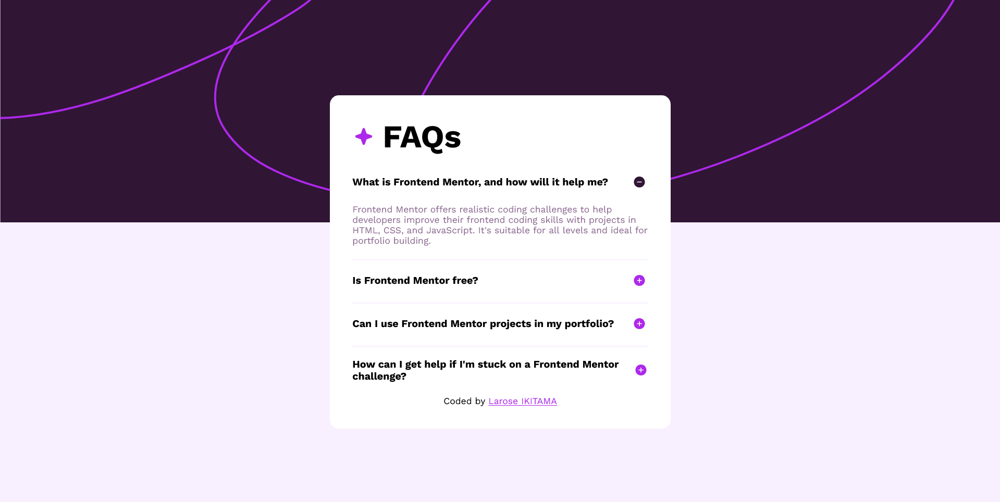

# Frontend Mentor - FAQ accordion solution

This is a solution to the [FAQ accordion challenge on Frontend Mentor](https://www.frontendmentor.io/challenges/faq-accordion-wyfFdeBwBz). Frontend Mentor challenges help you improve your coding skills by building realistic projects. 

## Table of contents

- [Frontend Mentor - FAQ accordion solution](#frontend-mentor---faq-accordion-solution)
  - [Table of contents](#table-of-contents)
  - [Overview](#overview)
    - [The challenge](#the-challenge)
    - [Screenshot](#screenshot)
    - [Links](#links)
  - [My process](#my-process)
    - [Built with](#built-with)
    - [What I learned](#what-i-learned)
  - [Author](#author)

## Overview

### The challenge

Users should be able to:

- Hide/Show the answer to a question when the question is clicked
- Navigate the questions and hide/show answers using keyboard navigation alone
- View the optimal layout for the interface depending on their device's screen size
- See hover and focus states for all interactive elements on the page

### Screenshot

### Links

- Solution URL: [Repository URL](https://your-solution-url.com](https://github.com/ikitamalarose/FAQ-accordion-challenge.git))
- Live Site URL: [Visit the website](https://faq-accordion-larose-ikitama.netlify.app/)

## My process

### Built with

- Semantic HTML5 markup
- CSS custom properties
- Flexbox
- CSS Grid
- JavaScript

### What I learned

In this project, I focused on improving accessibility, which included learning how to conduct Screen Reader Tests and Keyboard Accessibility Tests.

- Screen Reader Tests: I learned how to use screen readers to navigate and validate that all important content is accessible and correctly interpreted. This involved checking for appropriate use of ARIA labels, landmarks, and other semantic HTML elements that ensure a seamless experience for users who rely on screen readers.

- Keyboard Accessibility Tests: I also practiced verifying that all interactive elements can be accessed and used through keyboard-only navigation. This involved ensuring focus indicators were clear, logical tab order was maintained, and all buttons, links, and form controls responded correctly to keyboard input, making the application more inclusive.

This experience has enhanced my understanding of accessibility best practices and helped me create a more user-friendly, inclusive application.

## Author

- Frontend Mentor - [@ikitamalarose](https://www.frontendmentor.io/profile/ikitamalarose)
- GitHub - [@ikitamalarose](https://github.com/ikitamalarose)
- Email - [laroseikitama@gmail.com](mailto:laroseikitama@gmail.com)

